# mnemom/deploy

Centralized deployment orchestrator for all mnemom services.

## Architecture

```mermaid
flowchart LR
    subgraph triggers["Trigger"]
        dispatch["repo CI passes\n(repository_dispatch)"]
        manual["manual\n(workflow_dispatch)"]
    end

    subgraph tier1["Tier 1: Infrastructure"]
        gw["smoltbot / gateway\n☁️ CF Worker"]
        obs["smoltbot / observer\n☁️ CF Worker"]
        cli["smoltbot / cli\n📦 npm publish"]
    end

    subgraph tier2["Tier 2: Core API"]
        api["mnemom-api\n☁️ CF Worker"]
    end

    subgraph tier3["Tier 3: Services"]
        rep["mnemom-reputation\n☁️ CF Worker"]
        risk["mnemom-risk\n☁️ CF Worker"]
        prover["mnemom-prover\n🐍 Modal"]
    end

    subgraph independent["Independent"]
        web["mnemom-website\n🌐 Netlify"]
        hunt["hunter\n✈️ Fly.io"]
    end

    dispatch --> gw & obs & cli
    manual --> gw & obs & cli
    dispatch --> api
    manual --> api
    gw & obs --> api
    api --> rep & risk & prover
    dispatch --> web & hunt
    manual --> web & hunt
```



## How it works

1. **Any repo** merges to `main` or `staging`
2. That repo's CI runs and passes
3. CI dispatches to this orchestrator via `repository_dispatch`
4. **Staging**: deploys automatically
5. **Production**: single approval gate, then deploys

The dependency graph ensures upstream services deploy before downstream ones.
When deploying a single repo, unrelated jobs are skipped.

## Usage

### Automatic (via CI dispatch)

Each repo's CI workflow notifies this orchestrator on success:

```yaml
# Add to each repo's ci.yml — runs only on main/staging push, not PRs
- name: Trigger deploy
  if: github.event_name == 'push' && success()
  uses: peter-evans/repository-dispatch@v3
  with:
    token: ${{ secrets.DEPLOY_TOKEN }}
    repository: mnemom/deploy
    event-type: deploy
    client-payload: >-
      {
        "repo": "${{ github.event.repository.name }}",
        "sha": "${{ github.sha }}",
        "environment": "${{ github.ref == 'refs/heads/main' && 'production' || 'staging' }}"
      }
```

### Manual (deploy all or specific repos)

```bash
# Deploy everything to staging
gh workflow run deploy.yml --repo mnemom/deploy -f repos=all -f environment=staging

# Deploy just mnemom-api to production
gh workflow run deploy.yml --repo mnemom/deploy -f repos=mnemom-api -f environment=production

# Deploy smoltbot + mnemom-api together
gh workflow run deploy.yml --repo mnemom/deploy -f repos=smoltbot,mnemom-api -f environment=production
```

### Dashboard

View all deployments: **https://github.com/mnemom/deploy/actions**

Each run shows a visual dependency graph with color-coded status per service.

## Required secrets

Add these to the `mnemom/deploy` repo settings:

| Secret | Used by | Description |
|--------|---------|-------------|
| `DEPLOY_TOKEN` | All jobs | GitHub PAT with `repo` scope across mnemom org |
| `CLOUDFLARE_API_TOKEN` | smoltbot, api, reputation, risk | Cloudflare API token |
| `CLOUDFLARE_ACCOUNT_ID` | smoltbot, api, reputation, risk | Cloudflare account ID |
| `NPM_TOKEN` | smoltbot/cli | npm publish auth token |
| `MODAL_TOKEN_ID` | mnemom-prover | Modal deployment credentials |
| `MODAL_TOKEN_SECRET` | mnemom-prover | Modal deployment credentials |
| `FLY_API_TOKEN` | hunter | Fly.io deploy token |
| `NETLIFY_AUTH_TOKEN` | mnemom-website | Netlify deploy token |
| `NETLIFY_SITE_ID` | mnemom-website | Netlify site identifier |
| `VITE_SUPABASE_URL` | mnemom-website | Supabase URL (per environment) |
| `VITE_SUPABASE_ANON_KEY` | mnemom-website | Supabase anon key (per environment) |

Environment-specific secrets (e.g., `VITE_SUPABASE_URL`) should be set on the
`staging` and `production` environments, not at repo level.

## Environments

| Environment | Protection | Behavior |
|-------------|-----------|----------|
| `staging` | None | Auto-deploys on dispatch |
| `production` | Requires approval | Single approval covers all jobs in the run |
